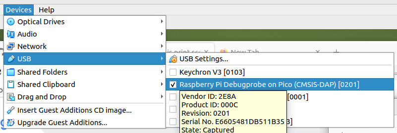

# pico-dev

Notes on learning Raspberry Pi pico project development.

A C development environment on a Virtualbox Ubuntu Mate guest is described for several reasons:
- the author's familiarity with the language and environment
- an opinion that this method forces one to have a deeper understanding of the system
- an opionion that open source tools are preferred

# Equipment

- Dell Optiplex desktop (purchased used from a vendor on Amazon)  
- several Pico 1 MCU (pico and pico W)  
- USB to serial converters  
- long USB cables  
- breadboards  
- jumper wires, a.k.a. [Dupont wires](https://www.reddit.com/r/electronics/comments/ioc6sf/i_finally_foundout_why_dupont_connectors_are/?rdt=36730)  

# References

1. Getting started with Raspberry Pi Pico-series, build-date: 2024-10-15, build-version: 2b6018e-clean  
2. Programming The Raspberry Pi Pico in C, First Printing, April 2021, Revison 0, ISBN: 9781871962680  
3. [RPi microcontroller documentation](https://www.raspberrypi.com/documentation/microcontrollers/)  

# Install Tools

1. sudo apt update  
1. sudo apt list --upgradable  
1. sudo apt upgrade  
1. sudo apt install automake autoconf build-essential texinfo libtool libftdi-dev libusb-1.0-0-dev pkg-config libhidapi-dev git minicom  
1. ls -l /dev/ | grep USB  
1. sudo apt remove brltty  
1. ls -l /dev/ | grep USB  

# Breadboard Configuration

add pic here

# Build/Load Debugprobe on Pico RP2040

1. git clone https://github.com/raspberrypi/debugprobe.git  
1. ls  
1. cd debugprobe/  
1. git submodule update --init  
1. mkdir build  
1. cd build/  
1. ls  
1. ls ../../  
1. export PICO_SDK_PATH=../../pico-sdk  
1. cmake -DDEBUG_ON_PICO=ON -DPICO_BOARD=pico ..  
1. ls  
1. make  
1. ls  
1. ls /  
1. ls /media/  
1. ls /media/mike/  
1. ls /media/mike/RPI-RP2/  
1. cp -v debugprobe_on_pico.uf2 /media/mike/RPI-RP2/  
1. ls /media/mike/RPI-RP2/  
1. ls /media/mike/  
1. download prog to pico-debugger using BOOTSEL method  
2. wire pico-debugger to DUT  

# Build/Run Openocd

Compile for Linux  

<https://forums.raspberrypi.com/viewtopic.php?t=347489>  
<https://github.com/libusb/hidapi?tab=readme-ov-file#installing-hidapi>  

1. git clone https://github.com/raspberrypi/openocd.git  
1. ls  
1. cd openocd/  
1. ./bootstrap  
1. ./configure --enable-cmsis-dap  
1. make  

modify /home/mike/dev/pico/openocd/tcl/target/rp2040.cfg:

	source [find /home/mike/dev/pico/openocd/tcl/target/swj-dp.tcl]  
	#source [find <absolute path>/target/swj-dp.tcl] # my comment  
	#source [find target/swj-dp.tcl] # original line only works from openocd build dir  

# Capture Pico Debugprobe USB in Virtualbox guest
- Run VB Mate/Ubuntu guest vm  
- Virtualbox device capture of Pico Debugprobe
  - VB vm menu->Devices->USB-><select Raspberry Pi Debugprobe on Pico (CMSIS-DAP)[201]>

# Serial Console Interface to pico Device Under Test
Start minicom before loading program:

	mike@xygdev3:~/dev/github/pico-dev/gmcount$ cat start_minicom.sh 
	#!/bin/bash

  	# use ttyACM0 for serial via Pico Debugprobe
	sudo minicom -D /dev/ttyACM0 -b 115200

 	# use ttyUBS0 for serial via USB-serial dongle
 	#sudo minicom -D /dev/ttyUSB0 -b 115200

# Use Openocd to flash pico RP2040 Device Under Test
Command:

	mike@xygdev3:~/dev/pico/openocd$ sudo src/openocd -s tcl -f tcl/interface/cmsis-dap.cfg -f tcl/target/rp2040.cfg -c "adapter speed 5000" -c "program <path to .elf file> verify reset exit"

Scripted:

 	#!/bin/bash
	
	PRG=$HOME/dev/github/pico-dev/scsd/build/simple_example.elf

	PICO_DEV=/home/mike/dev/pico
	OPENOCD_D=$PICO_DEV/openocd
	OPENOCD=$OPENOCD_D/src/openocd
	IF_CFG=$OPENOCD_D/tcl/interface/cmsis-dap.cfg
	TGT_CFG=$OPENOCD_D/tcl/target/rp2040.cfg
	
	sudo $OPENOCD \
	    -s tcl \
		-f $IF_CFG \
		-f $TGT_CFG \
		-c "adapter speed 5000" \
		-c "program $PRG verify reset exit"   

Sample output:

	mike@xygdev3:~/dev/github/pico-dev/scsd$ ./load_scsd.sh 
	[sudo] password for mike: 
	Open On-Chip Debugger 0.12.0+dev-gebec9504d-dirty (2025-03-31-19:17)
	Licensed under GNU GPL v2
	For bug reports, read
		http://openocd.org/doc/doxygen/bugs.html
	Info : Hardware thread awareness created
	Info : Hardware thread awareness created
	adapter speed: 5000 kHz
	Info : Using CMSIS-DAPv2 interface with VID:PID=0x2e8a:0x000c, serial=E6605481DB511B35
	Info : CMSIS-DAP: SWD supported
	Info : CMSIS-DAP: Atomic commands supported
	Info : CMSIS-DAP: Test domain timer supported
	Info : CMSIS-DAP: FW Version = 2.0.0
	Info : CMSIS-DAP: Interface Initialised (SWD)
	Info : SWCLK/TCK = 0 SWDIO/TMS = 0 TDI = 0 TDO = 0 nTRST = 0 nRESET = 0
	Info : CMSIS-DAP: Interface ready
	Info : clock speed 5000 kHz
	Info : SWD DPIDR 0x0bc12477, DLPIDR 0x00000001
	Info : SWD DPIDR 0x0bc12477, DLPIDR 0x10000001
	Info : [rp2040.core0] Cortex-M0+ r0p1 processor detected
	Info : [rp2040.core0] target has 4 breakpoints, 2 watchpoints
	Info : [rp2040.core0] Examination succeed
	Info : [rp2040.core1] Cortex-M0+ r0p1 processor detected
	Info : [rp2040.core1] target has 4 breakpoints, 2 watchpoints
	Info : [rp2040.core1] Examination succeed
	Info : starting gdb server for rp2040.core0 on 3333
	Info : Listening on port 3333 for gdb connections
	[rp2040.core0] halted due to breakpoint, current mode: Thread 
	xPSR: 0xf1000000 pc: 0x000000ea msp: 0x20041f00
	[rp2040.core1] halted due to debug-request, current mode: Thread 
	xPSR: 0xf1000000 pc: 0x000000ea msp: 0x20041f00
	** Programming Started **
	Warn : Function FUNC_BOOTROM_STATE_RESET not found in RP2xxx ROM. (probably an RP2040 or an RP2350 A0)
	Warn : Function FUNC_FLASH_RESET_ADDRESS_TRANS not found in RP2xxx ROM. (probably an RP2040 or an RP2350 A0)
	Info : RP2040 Flash Probe: 33554432 bytes @0x10000000, in 8192 sectors
	
	Info : Padding image section 1 at 0x1000e5a8 with 88 bytes (bank write end alignment)
	Warn : Adding extra erase range, 0x1000e600 .. 0x1000efff
	** Programming Finished **
	** Verify Started **
	** Verified OK **
	** Resetting Target **
	shutdown command invoked

# sigrok Pulseview
[sigrok Github project](https://github.com/sigrokproject)

## Install
1. sudo apt install -y libsigrok-dev
2. sudo apt install sigrok-firmware-fx2lafw
3. sudo apt install -y pulseview

## Startup
1. VB vm: attach USB in Devices->USB->sigrok fx2lafw
2. on command line, enter: pulseview

## In-program Configuration
1. Select "Connect to device" pull-down menu (it will have a device name if this has been configured previously)
2. choose driver: fx2lafw
3. choose interface: USB
4. scan for device
5. select: Saleae Logic with 8 channels
6. press OK

# Gieger-Muller Counter

pic of dev hardware

1. cd gmcount
2. follow instructions in README.txt
